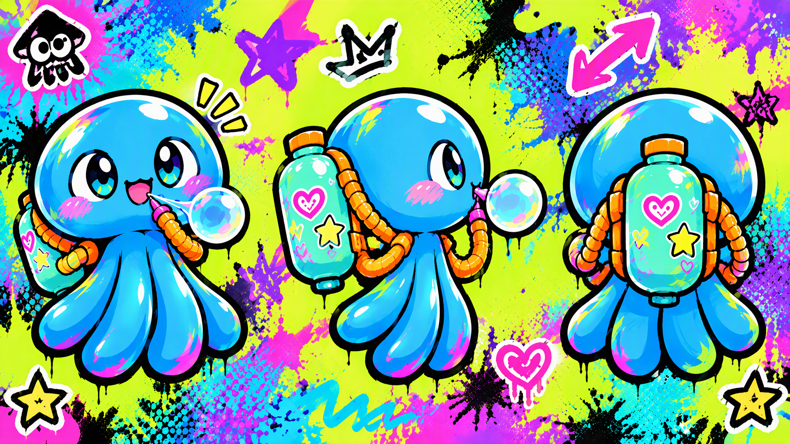
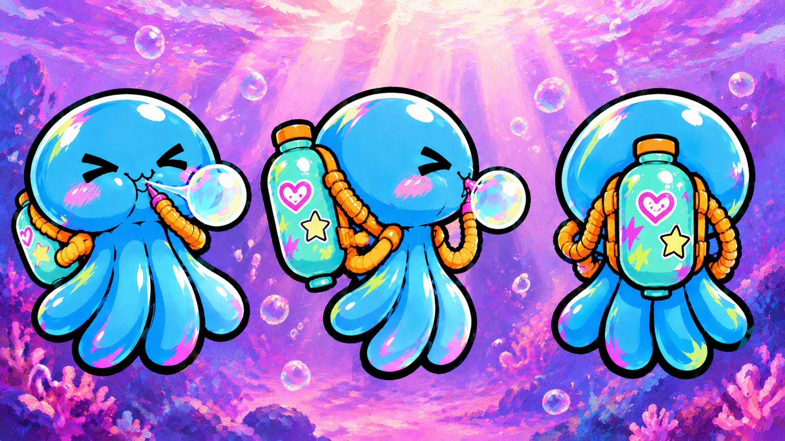
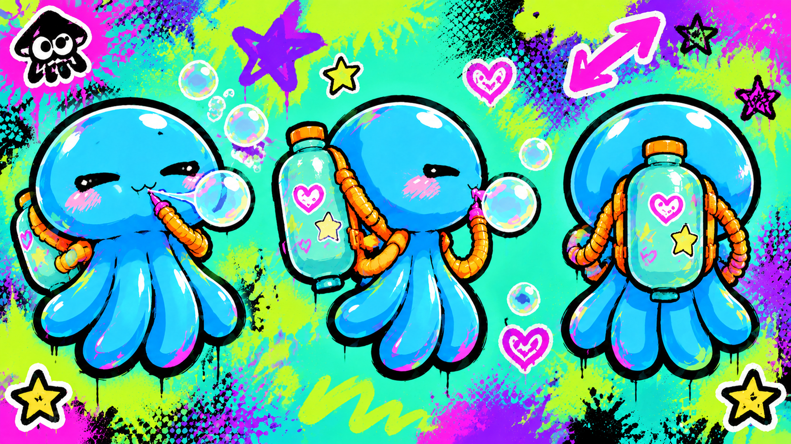
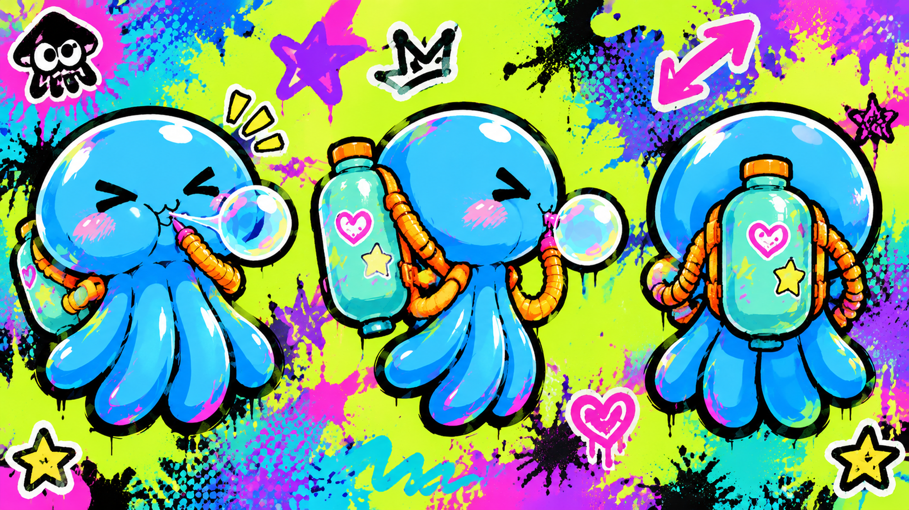
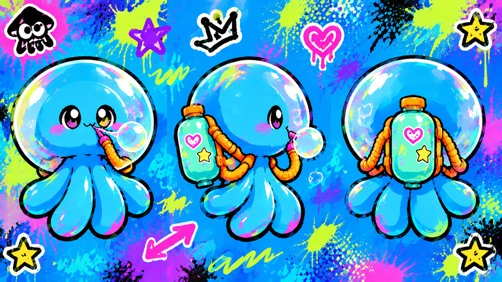
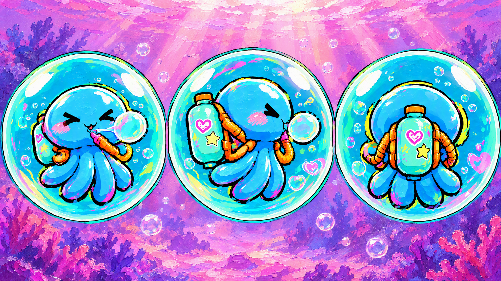
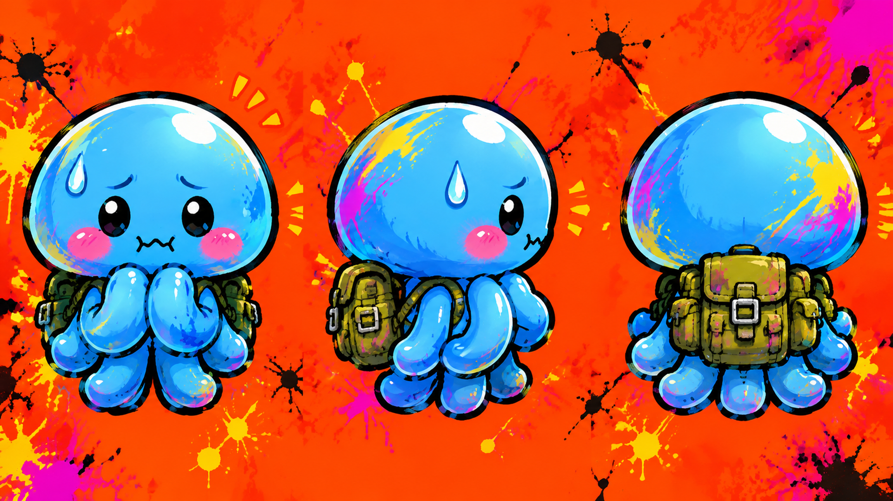
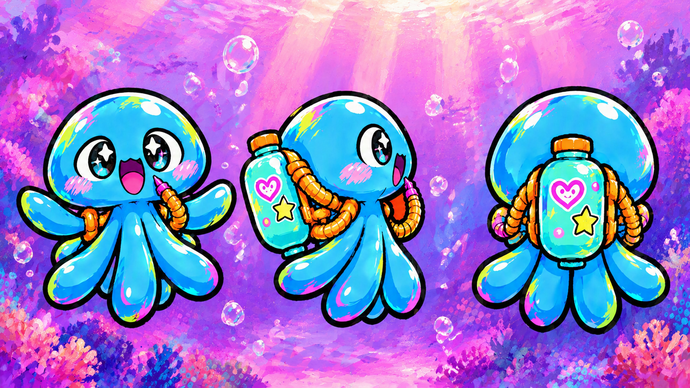
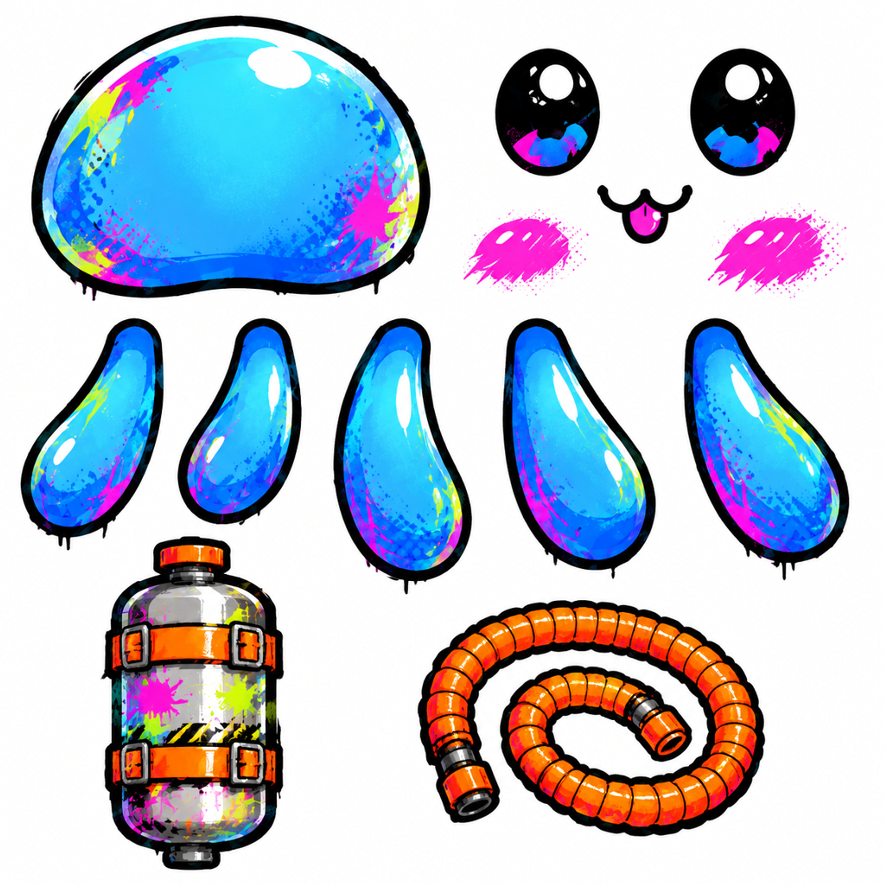

# 美术需求

> **版本 v2.24** ｜ 2026-10-09 ｜ 从 [04-完整策划案.md](04-完整策划案.md) 提取整合
>
> **本文档是给美术同学的需求说明**——策划案里所有与美术相关的内容都汇总于此。

---

## 一、整体风格

### 1.1 画风

| 项 | 要求 |
|----|------|
| 画风 | **手绘厚涂** |
| 维度 | **3D**（角色可用 2D 立绘） |
| 统一原则 | **一切皆泡泡** |

### 1.2 手绘厚涂的视觉特征

| 项 | 要求 |
|----|------|
| 笔触 | **可见的手绘笔触**，不追求平滑 |
| 质感 | 颜料堆积感、色彩交融、边缘柔和 |
| 光影 | 柔和的体积感，非硬边赛璐璐 |
| 线条 | **弱化描边** |
| 氛围 | 温暖、朦胧、有"手作感" |

> **参考**：《明日方舟》「火山旅梦」活动的 CG 质感。

### 1.3 当前折中方案

> ⚠️ **角色本体保留现有设计（含描边），场景背景采用厚涂风格。**
>
> 这是阶段性方案——角色设计已成熟，暂不重画。
> 若后续需要统一，可再调整。

---

## 二、色彩规范

### 2.1 主色板

**核心三色：粉 / 紫 / 青**——粉紫为基调，青为对比。

| 色名 | 色号 | 环境用途 | **泡泡墙用途** |
|------|------|---------|---------------|
| **云粉** | `#F5C6D8` | 天空、光晕、氛围 | **普通可破坏墙** |
| **雾紫** | `#B48BC4` | 深度、远景、梦幻感 | **不可破坏墙** |
| **水青** | `#7ED4D4` | 水面、冷调对比 | **弹性墙** |

### 2.2 扩展色板

| 色名 | 色号 | 环境用途 | **泡泡墙用途** |
|------|------|---------|---------------|
| **霞粉** | `#FFE0EC` | 高光、云层 | 普通墙高光面 |
| **藕荷** | `#D9A8D0` | 粉紫过渡 | 普通墙阴影面 |
| **深紫** | `#6B5B8C` | 远景、阴影 | 不可破坏墙阴影面 |
| **夜紫** | `#4A3F6B` | 最深处、深渊 | **深渊 / 虚空边界** |
| **暖橙** | `#FFB87C` | 暖光、强调点 | **爆炸墙** |
| **珊瑚** | `#FF9E9E` | 珊瑚元素 | **脆弱墙** |
| **深海青** | `#3A8FA0` | 水下阴影 | 弹性墙阴影面 |
| **云白** | `#FAF6F8` | 呼吸空间 | **未激活 / 空状态** |

### 2.3 配色逻辑

```
冷色（粉/紫/青）  →  安全、可交互
暖色（橙/珊瑚）    →  危险、需谨慎
深浅变化           →  可破坏 vs 不可破坏
```

> **设计要点**：
> - **可破坏的墙用浅色**（云粉）——视觉上"轻"
> - **不可破坏的墙用深色**（雾紫）——视觉上"重"
> - **危险物用暖色**（暖橙、珊瑚）——警示对比
>
> **玩家不需要教程，看颜色就知道这面墙能不能碰。**

---

## 三、泡泡墙材质配色表

> ⚠️ **不同功能的墙用不同配色。**

| 材质 | 主色 | 色号 | 特征 | 玩法 |
|------|------|------|------|------|
| **普通墙** | 云粉 | `#F5C6D8` | 半透明粉，柔和 | 可破坏，会愈合 |
| **不可破坏墙** | 雾紫 | `#B48BC4` | 深紫，厚重感 | 无法破坏，关卡边界 |
| **弹性墙** | 水青 | `#7ED4D4` | 半透明青，有弹性 | 可弹跳、可穿过 |
| **爆炸墙** | 暖橙 | `#FFB87C` | 橙色，有脉动感 | 靠近/触碰会爆炸 |
| **脆弱墙** | 珊瑚 | `#FF9E9E` | 浅珊瑚色，有裂纹 | 一碰就碎，不愈合 |
| **虚空/深渊** | 夜紫 | `#4A3F6B` | 近黑紫，无底感 | 掉入即死 |

### 恢复过程的表现

**恢复不是重置，是愈合**——需要**让玩家看得见这个过程**。

```
破坏后的墙体
     ↓  ① 分裂      墙体裂成小块
     ↓  ② 膨胀      向外弥散，填补空隙
     ↓  ③ 融合      重新结合成完整墙体
   恢复完成
```

> **美术要点**：这个过程要**可视**——玩家亲眼看到泡泡"流回去"。

---

## 四、场景设计

### 4.1 地图结构：箱庭

| 项 | 内容 |
|----|------|
| 结构 | **箱庭**（Diorama / 微缩景观） |
| 视角 | **斜俯视**（固定机位） |
| 边界 | 每关是独立的封闭空间 |

```
┌─────────────────┐
│   ╭─────────╮   │  ← 箱庭边界（泡泡膜）
│   │  水下   │   │
│   │  🪸 ◆   │   │      ◆ 玩家
│   ╰─────────╯   │      🪸 珊瑚
└─────────────────┘
```

### 4.2 场景演进

| 关卡 | 场景 |
|------|------|
| **第 1 关** | **纯白空间**（特例——记忆尚未开始） |
| **第 2 关起** | **海洋水下 / 水底**——珊瑚、海草、水泡、光线 |

### 4.3 海洋元素清单

| 元素 | 用途 |
|------|------|
| **珊瑚** | 装饰、平台、障碍 |
| **海草** | 动态装饰、可穿过 |
| **水泡** | 上升气流、视觉引导 |
| **光线** | 水下体积光、氛围 |
| **岩石** | 地形、掩体 |
| **贝壳 / 海星** | 点缀、可交互物 |

### 4.4 参考图

\

*（整体基调参考）*

\

*（关卡场景参考——斜俯视箱庭）*

\

*（地编同学参考图，不一定要做成这样）*

### 4.5 情绪演进（配色）

| 阶段 | 主色调 | 情绪 |
|------|--------|------|
| 1 | 云白 + 霞粉 | 空白、初醒 |
| 2 | 粉紫 + 水青 | 探索、好奇 |
| 3 | 粉紫 + 珊瑚 | 生动、丰富 |
| 4 | 深紫 + 夜紫 + 深海青 | 压抑、坠落 |
| 5 | 回归 云粉 + 霞粉 | 释然、回归 |

> **色彩也是莫比乌斯**：第 5 关的配色 = 第 1 关的配色。

---

## 五、角色设计

### 5.1 两种呈现形式

| 形式 | 用途 | 说明 |
|------|------|------|
| **游戏内** | 实际游玩 | 蓝色水母造型，圆润 Q 版 |
| **人形立绘** | 剧情演出、菜单、宣传 | 水母特征的人形化 |

### 5.2 游戏内形象

| 项 | 内容 |
|----|------|
| 造型 | **蓝色水母**——圆顶状头部、5 条圆润触手 |
| 配饰 | **可爱储泡泡液罐**——圆润糖果色罐身、爱心/星星贴纸、橙色布质绑带、螺旋软管 |
| 面部 | 大号黑眼睛（带高光）、粉色腮红 |
| 比例 | 圆润的卡通比例（头大身小） |
| 配色 | 水青 `#7ED4D4` 为主，配霞粉 `#FFE0EC` 高光 |

> **为什么是储罐而不是背包**：罐子里的液体是**泡泡液的来源**——
> 它让"吐泡泡"这件事有了**物质依据**。
>
> ⚠️ **罐子要可爱，不要工业风**。

### 5.3 人形立绘设定

| 项 | 内容 |
|----|------|
| 定位 | 水母的**人形化**——同一个角色的另一种呈现 |
| 保留元素 | 水母伞盖 → 发型/头饰；触手 → 发丝/裙摆；储液罐 → 随身容器 |
| 配色 | 与水母形态一致：水青 + 霞粉 |
| 气质 | 朦胧、温柔、略带忧郁 |
| 用途 | 剧情演出、主菜单、宣传物料 |

> **设计要点**：人形立绘要让玩家**一眼认出**"这就是那只水母"。

### 5.4 角色三视图（8 张状态差分）

> 每张含**正 / 侧 / 背**三个视图，供 3D 建模参考。

**弹力泡泡**

| 不蓄力 | 蓄力 |
|--------|------|
| \ | \ |

**浮粘泡泡**

| 不蓄力 | 蓄力 |
|--------|------|
| \ | \ |

**两种漂浮状态**：

| 蓄力漂浮 | 泡泡空间漂浮 |
|---------|-------------|
| \ | \ |

**炸弹泡泡**

| 不蓄力 | 蓄力 |
|--------|------|
| \ | \ |

### 5.5 表情差分

**蓄力与不蓄力，表情完全不同**——这是给玩家的**即时反馈**。

| 泡泡 | 不蓄力 | 蓄力 |
|------|--------|------|
| **弹力** | 轻松嘟嘴吹小泡泡，开心 | 腮帮鼓到极限，眼睛紧闭，身体后仰 |
| **浮粘** | 温柔吐气，眼神迷离放松 | 憋到脸变紫红，眼睛瞪大凸出，搞怪 |
| **炸弹** | 小心翼翼，抿嘴紧张，冒汗 | 夸张惊恐又兴奋，张嘴瞪眼 |

> 💡 **表情本身就是 UI**——玩家不需要读条，
> **看角色表情就知道蓄力进度**。

### 5.6 ⚠️ 表情红线：搞笑但不丑化

| ✅ 可以 | ❌ 不可以 |
|--------|----------|
| 鼓腮、脸红 | 爆青筋 |
| 眼睛挤成 `><` | 眼球凸出 |
| 小汗珠 | 脸色发紫发黑 |
| 用力的小火花 | 五官扭曲变形 |

> **搞笑来自"可爱的努力"，不是来自"丑"。**

### 5.7 Spine 部件拆分

\

**拆分为 13 个独立部件**：

| 部件 | 数量 |
|------|------|
| 头部 | 1 |
| 眼睛 | 2 |
| 嘴巴 | 1 |
| 腮红 | 2 |
| 触手 | 5 |
| 储泡泡液罐 | 1 |
| 软管 | 1 |

**动画用途**：

| 动画 | 用到的部件 |
|------|-----------|
| 待机（呼吸） | 头部 + 触手轻微摆动 |
| 蓄力（鼓腮） | 头部形变 + 眼睛变化 |
| 吐泡泡 | 嘴巴 + 头部前倾 |
| 漂浮 | 全部触手摆动 |

> **拆分原则**：面部五官独立 → **一张头 + 不同五官组合出所有表情**，
> 大幅降低美术量。

---

## 六、泡泡空间表现

### 6.1 三种泡泡的视觉区分

| 泡泡 | 颜色 | 内部特征 | 角色姿态 |
|------|------|---------|---------|
| **弹力** | 蓝 | 表面有弹性拉伸形变 | 被弹射出去 |
| **浮粘** | 青绿 | 内壁有上升的气泡，失重感 | 轻盈漂浮 |
| **炸弹** | 橙红 | 能量涌动、碎块翻腾 | 抱膝防御 |

> **区分原则**：靠**颜色 + 内部动态**区分，不靠形状（形状统一为球体）。
> 玩家一眼就能判断这是哪种泡泡。

\

### 6.2 世界层泡泡（初版）

\

*（Unity 中的初版可破坏泡泡，尚未美术加工）*

---

## 七、动画需求

> ⚠️ **动画是本作的大项**——几乎每个交互都需要动画反馈。
>
> 核心原则：**反馈优先于文字**——玩家一操作，世界立刻有反应。

### 7.1 角色动画（水母主角）

#### 基础动作

| 动画 | 说明 |
|------|------|
| **待机** | 呼吸起伏 + 触手缓慢飘动（循环） |
| **移动** | 左右移动，身体微微倾斜 |
| **跳跃** | 起跳蓄力 → 上升 → 下落 → 落地缓冲 |
| **转向** | 左右转身 |

#### 能力动作

| 动画 | 说明 |
|------|------|
| **蓄力** | 鼓腮——**分阶段**（小/中/大，对应蓄力量） |
| **吐泡泡** | 释放瞬间 |
| **被泡泡包裹漂浮** | 触手舒展，泡泡包裹 |
| **泡泡空间漂浮** | 失重漂浮，触手自然舒展 |

#### 状态动作

| 动画 | 说明 |
|------|------|
| **受伤 / 被击退** | 受冲击 |
| **软死亡** | **变透明、变灰、触手无力**（见 8.3） |
| **消散** | 死亡/结局时的消散 |

---

### 7.2 泡泡墙动画 ⭐

> **重点：要有"泡泡"的质感——柔软、有弹性、半透明，不是石头碎裂。**

#### 破裂（分裂）

```
① 撞击瞬间  →  接触点出现涟漪 / 高光
② 裂纹      →  从撞击点扩散（像水面裂开）
③ 分裂      →  碎成小块        ← 呼应规则①
④ 飞散      →  小块向外弹开，带弹性
⑤ 残留      →  小碎块飘浮，慢慢消散
```

#### 愈合（恢复）

```
① 触发      →  周围泡泡开始反应
② 膨胀      →  碎片向外弥散、填补空隙  ← 呼应规则③
③ 融合      →  碎片聚合              ← 呼应规则②
④ 完成      →  表面恢复，"啵"地收束
```

> 💡 **这两段动画本身就是教学**——
> 玩家看完就理解了三条规则，**不需要任何文字说明**。

#### 各材质的特殊动画

| 材质 | 动画 |
|------|------|
| **普通墙** | 破裂、愈合、被撞反馈 |
| **弹性墙** | 被撞时**形变回弹**、穿过时的涟漪 |
| **脆弱墙** | 一碰即碎的爆裂（**不愈合**） |
| **爆炸墙** | **待机脉动**（危险预警）→ 爆炸 |
| **不可破坏墙** | 撞击无变化，但有"**撞不动**"的反馈 |

---

### 7.3 泡泡动画（玩家发射的）

| 阶段 | 动画 |
|------|------|
| **发射** | 从角色口中/手中飞出 |
| **飞行** | 空中轨迹、拖尾 |
| **落点预览** | 引导线末端的落点标记 |
| **落地 / 放置** | 轻轻落地、微微弹动 |
| **弹射**（弹力） | 被撞击后弹开 |
| **漂浮**（浮粘） | 缓慢上浮 |
| **粘合**（浮粘） | 与其他泡泡吸附、融合 |
| **引爆**（炸弹） | 倒计时闪烁 → 爆炸 |
| **自动消散** | 逐渐透明 → 消失 |

---

### 7.4 泡泡潮动画

| 动画 | 说明 |
|------|------|
| **扩散** | 从角落蔓延的推进感 |
| **分裂增殖** | 不断生出新泡泡 |
| **被破坏** | 打掉一块，但周围继续长 |
| **逼近** | 靠近玩家时的压迫感 |

> **设计要点**：要让玩家**直观感受到"它在逼近"**——
> 不是屏幕上的数字，而是**看得见的威胁**。

---

### 7.5 环境动画

| 元素 | 动画 |
|------|------|
| **水下光线** | 体积光缓慢流动 |
| **海草** | 随水流摆动 |
| **珊瑚** | 轻微呼吸感 |
| **水泡** | 持续上升 |
| **记忆残影** | 浮现 → 停留 → 消散 |
| **深渊** | 吞噬感、缓慢涌动 |

---

### 7.6 UI 动画

| 元素 | 动画 |
|------|------|
| **泡泡值条** | 增减时的过渡 |
| **蓄力指示** | 随蓄力增长 |
| **泡泡切换** | 切换时的转场 |
| **记忆文字** | 浮现 → 停留 → 淡出 |
| **软死亡提示** | 强调出现 |

---

### 7.7 叙事动画

| 动画 | 说明 |
|------|------|
| **关卡开场** | 进入新关卡的过渡 |
| **记忆触发** | 记忆显现的演出 |
| **结局** | **放弃记忆的消散**（全作高潮） |

---

### 7.8 动画优先级

| 优先级 | 动画 | 理由 |
|--------|------|------|
| 🔴 **P0** | 泡泡墙破裂/愈合、角色蓄力、吐泡泡 | **核心反馈**，没有就没法玩 |
| 🟠 **P1** | 泡泡发射/落地、弹射、漂浮、粘合 | 主要交互反馈 |
| 🟡 **P2** | 环境动画、UI 动画 | 氛围与体验 |
| 🟢 **P3** | 叙事动画、过场 | 打磨阶段 |

> **建议**：P0/P1 用简单动画先跑通，**验证手感后再精修**。

---

## 八、记忆反馈表现

**克制原则**：不弹窗、不打断、不用大段文字。

| 反馈类型 | 表现 |
|---------|------|
| **残影** | 浮现半透明人影，数秒后消失 |
| **声音** | 环境音变化，或一句极轻的旁白 |
| **画面** | 色调微变、光晕 |
| **文字** | **最多一句**，出现在画面边缘 |

---

## 九、UI 交互稿

> ⚠️ **本章为 UI 设计稿**——供 UI 美术同学直接使用。

### 9.0 设计基调

| 项 | 内容 |
|----|------|
| 统一原则 | **一切皆泡泡**——所有 UI 元素都用泡泡形态 |
| 整体风格 | 极简、低干扰、半透明 |
| 配色 | 沿用主色板（云粉 / 雾紫 / 水青） |
| 交互哲学 | **能不用 UI 就不用**——让世界本身当界面 |

---

### 9.1 游戏内 HUD

#### 布局总览

```
┌─────────────────────────────────────────┐
│  ◯◯◯         [提示文字]                 │  ← 顶部：记忆文字（临时）
│                                         │
│                                         │
│              ◆ 玩家                      │
│                                         │
│                                         │
│  ◉ 泡泡值                    ①②③       │  ← 底部：资源 + 泡泡切换
└─────────────────────────────────────────┘
```

**极简原则**：默认只有**泡泡值**常驻，其余全部临时出现。

#### 元素详解

**① 泡泡值指示器**（左下，常驻）

```
        ╭─────────╮
        │  ◉◉◉◉◉  │   泡泡串，满 = 5 个泡泡
        │  ◉◉○○○  │   当前 2/5
        ╰─────────╯
```

| 项 | 设计 |
|----|------|
| 形态 | **一串小泡泡**（不是传统长条） |
| 位置 | 左下角 |
| 满值 | 泡泡串全满，微微发光 |
| 消耗 | 泡泡逐个消失（"啵"地破掉） |
| 低资源 | 剩余泡泡**变红 + 抖动** |
| 归零 | 泡泡串全空，变灰 |

> **为什么用泡泡串而不是长条**：
> 符合"一切皆泡泡"，而且**离散的泡泡比连续的长条更容易读**——
> 玩家一眼看出"还剩几个"。

**② 蓄力指示器**（蓄力时出现，跟随角色）

```
        角色头顶
           ↓
        ╭─────╮
        │ ◯   │   ← 泡泡从小变大
        ╰─────╯
        ▓▓▓▓░░░░  ← 蓄力进度
```

| 项 | 设计 |
|----|------|
| 位置 | 跟随角色（头顶） |
| 形态 | **一个正在变大的泡泡** |
| 进度 | 泡泡大小 = 蓄力进度 |
| 消耗预览 | 旁边显示即将消耗的泡泡值 |
| 满蓄力 | 泡泡微微发光/脉动 |

> **设计要点**：蓄力**同时用两种方式表达**——
> 角色的**鼓腮表情** + 头顶的**泡泡大小**。
> 双通道反馈，玩家不会看漏。

**③ 泡泡切换**（切换时短暂出现）

```
         ╭───────────────────╮
         │  ①弹力  ②浮粘  ③炸弹 │
         ╰───────────────────╯
              ▲ 当前选中
```

| 项 | 设计 |
|----|------|
| 位置 | 底部中央 |
| 形态 | **三个泡泡图标**，当前选中的放大 |
| 出现 | 切换时淡入，2 秒后淡出 |
| 图标 | 弹力=蓝 / 浮粘=青 / 炸弹=橙（同配色表） |

**④ 炸弹状态**（有炸弹时出现）

```
         ╭──────────╮
         │  ● 已放置 │   ← 一次只能一枚
         ╰──────────╯
```

| 项 | 设计 |
|----|------|
| 位置 | 右下角 |
| 形态 | 一个小炸弹泡泡图标 |
| 作用 | 提示"当前有炸弹在场"，以及**引爆键** |

**⑤ 记忆文字**（记忆触发时）

```
┌─────────────────────────────────────────┐
│                                         │
│                                         │
│           「你以前睡在这里。」            │  ← 画面中下，淡淡浮现
│                                         │
└─────────────────────────────────────────┘
```

| 项 | 设计 |
|----|------|
| 位置 | 画面中下 |
| 字体 | 手写感 / 柔和 |
| 出现 | 淡入 → 停留 3 秒 → 淡出 |
| 数量 | **一次最多一句**（克制原则） |

---

### 9.2 瞄准与落点预览

> ⚠️ **这是最重要的交互反馈**——玩家必须知道泡泡会落在哪。

#### 引导线

```
        角色
         ↓
        ◆ ┄┄┄┄┄┄┄┄┄○      ← 虚线抛物线
                      ↑
                   落点标记
```

| 元素 | 设计 |
|------|------|
| **虚线** | 从角色发出的抛物线，**泡泡形态的小点**组成 |
| **落点标记** | 一个**脉动的空心泡泡圈** |
| **颜色** | 跟随当前泡泡类型（蓝/青/橙） |
| **蓄力影响** | 蓄力越久，抛物线越远，落点标记越大 |

#### 落点有效性

```
有效落点         无效落点
   ◎               ⊘
 （实心脉动）      （红色叉号）
```

| 状态 | 表现 |
|------|------|
| **可放置** | 空心泡泡圈，脉动 |
| **不可放置** | 变成**红色叉号**（如位置被占、超出范围） |

---

### 9.3 软死亡提示

**泡泡值归零时**，需要明确告诉玩家"你过不去了"。

```
┌─────────────────────────────────────────┐
│                                         │
│              角色变灰、变透明             │
│                                         │
│            「泡泡液耗尽了……」             │
│                                         │
│              [ 按 R 重开 ]               │
└─────────────────────────────────────────┘
```

| 元素 | 设计 |
|------|------|
| **角色** | 变灰、变透明、触手无力下垂 |
| **文字** | 画面中央，柔和但明确 |
| **重开提示** | 按键提示，**必须显眼** |

> **设计要点**：软死亡是"慢慢意识到过不去"，
> 但**不能连"死了"都要慢慢发现**——提示必须清晰。

---

### 9.4 增值泡泡潮警示

泡泡潮逼近时需要**警示**，但不打断。

```
        屏幕边缘泛红/泛紫
        ┌─────────────────┐
        │▓▓▓▓▓▓▓▓▓▓▓▓▓▓▓▓│  ← 边缘脉动
        │▓▓             ▓▓│
        │▓▓     ◆      ▓▓│
        │▓▓             ▓▓│
        │▓▓▓▓▓▓▓▓▓▓▓▓▓▓▓▓│
        └─────────────────┘
```

| 距离 | 表现 |
|------|------|
| **远** | 无提示 |
| **中** | 屏幕边缘**轻微泛色** |
| **近** | 边缘**脉动加剧** + 轻微镜头震动 |
| **极近** | 边缘**强脉动** + 角色周围出现泡泡 |

> **设计要点**：用**屏幕边缘**表达威胁，不占用画面中央——
> 玩家还在专注解谜，**余光能感知到危险**。

---

### 9.5 菜单界面

#### 主菜单

```
        ╭─────────────────────────╮
        │                         │
        │         《泡涌》          │
        │       （泡泡形态标题）     │
        │                         │
        │      ◯ 开始游戏          │
        │      ◯ 继续              │
        │      ◯ 设置              │
        │      ◯ 退出              │
        │                         │
        ╰─────────────────────────╯
        背景：粉紫水下 + 缓慢漂浮的气泡
```

| 项 | 设计 |
|----|------|
| 标题 | **泡泡形态的字体**，或泡泡拼成的字 |
| 按钮 | **泡泡按钮**，hover 时微微膨胀 |
| 背景 | 粉紫水下场景 + 漂浮气泡（动态） |

#### 暂停菜单

```
        ╭─────────────────────────╮
        │                         │
        │        ◯ 继续            │
        │        ◯ 重开本关         │
        │        ◯ 设置            │
        │        ◯ 返回主菜单       │
        │                         │
        ╰─────────────────────────╯
        背景：游戏画面模糊 + 半透明遮罩
```

| 项 | 设计 |
|----|------|
| 遮罩 | 半透明，**不遮挡太多** |
| 按钮 | 泡泡按钮 |
| 呼出 | ESC |

#### 设置界面

| 分类 | 项 |
|------|-----|
| **音量** | 总音量 / 音乐 / 音效（滑块用泡泡串） |
| **画面** | 画质、全屏、分辨率 |
| **操作** | 键位重映射 |
| **辅助** | 字幕开关 |

> **设计要点**：滑块的"填充部分"用**泡泡串**表示——
> 和泡泡值指示器保持一致的视觉语言。

---

### 9.6 UI 动效规范

| 元素 | 动效 |
|------|------|
| **出现** | 从中心**膨胀**出来（像吹泡泡） |
| **消失** | **收缩**然后"啵"地破掉 |
| **按钮 hover** | 微微**膨胀** + 发光 |
| **按钮点击** | 快速**收缩回弹** |
| **数值变化** | 泡泡逐个增减 |

> **统一原则**：**所有 UI 元素的出现/消失都遵循"吹泡泡"的物理感**——
> 膨胀出现，破掉消失。这是"一切皆泡泡"在动效层的贯彻。

---

### 9.7 UI 资产清单

供 UI 美术同学制作：

| 资产 | 数量 | 说明 |
|------|------|------|
| 泡泡值指示器 | 1 套 | 满/中/低/空 4 种状态 |
| 蓄力指示器 | 1 套 | 分阶段（小/中/大） |
| 泡泡图标 | 3 个 | 弹力/浮粘/炸弹 |
| 炸弹状态图标 | 1 个 | |
| 落点标记 | 2 个 | 有效/无效 |
| 引导线 | 1 套 | 虚线点 |
| 按钮 | 1 套 | 常态/hover/点击/禁用 |
| 滑块 | 1 套 | |
| 遮罩 | 1 个 | 半透明 |
| 字体 | 1 套 | 主字体 + 手写感字体（记忆文字用） |

---

### 9.8 ⚠️ 待确认

| # | 问题 |
|---|------|
| 1 | 泡泡值指示器用**泡泡串**还是**长条**？ |
| 2 | 是否需要**小地图**（箱庭地图）？ |
| 3 | 记忆图鉴界面是否需要？ |
| 4 | 关卡选择界面？ |

---

## 十、音效需求

### 10.1 核心音效

| 事件 | 音效 |
|------|------|
| 蓄力 | 逐渐升高的嗡鸣 |
| 释放 | "啵"的一声 |
| 弹力泡泡 | 弹性回响 |
| 浮粘泡泡 | 轻柔的气泡声 |
| 炸弹爆炸 | 低沉爆破 + 水花 |
| 掉入深渊 | 声音被吸入、消失 |
| 记忆显现 | 音乐进入一段温柔旋律 |

### 10.2 音乐设计

| 章节 | 音乐 |
|------|------|
| 序 | 钢琴单音，稀疏、温柔 |
| 破 | 加入低频弦乐，逐渐不和谐 |
| 急 | 弦乐紧张，节奏加快 |
| 结局 | 回到开头的钢琴单音，然后归于静默 |

> **音乐也是莫比乌斯**：结局的音乐 = 开头的音乐。

---

## 十一、交付与协作

### 11.1 资产位置

美术资产放在 **`Art` 分支**，参考图与设计稿见 `docs/plan/images/`。

### 11.2 灰盒优先

> **先灰盒，再精美**——程序先用占位物验证规则，美术再围绕已稳定规则投入制作。

### 11.3 反馈优先于文字

美术优先构建"**玩家一操作，世界立刻变化**"的反馈，降低教程文字依赖。

---

## 十二、待确认

| # | 问题 |
|---|------|
| 1 | 美术风格：Splatoon 3 风 vs 清新柔和风（美术组决策中） |
| 2 | 角色是否统一为厚涂风格（去掉描边） |
| 3 | 人形立绘的具体设计 |
