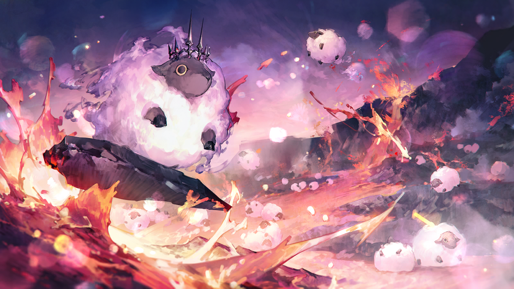
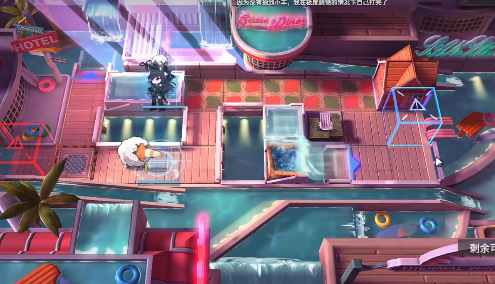
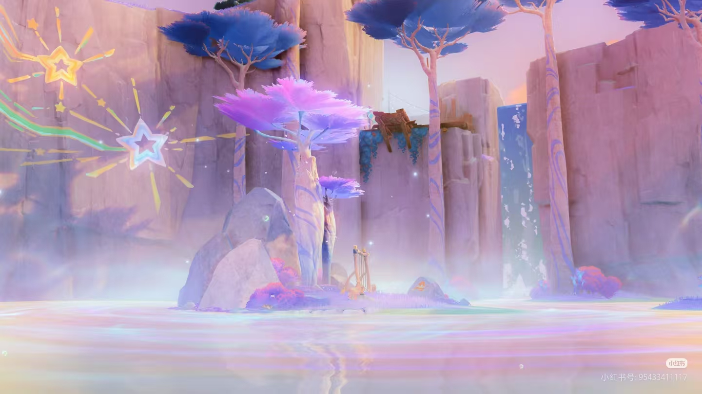
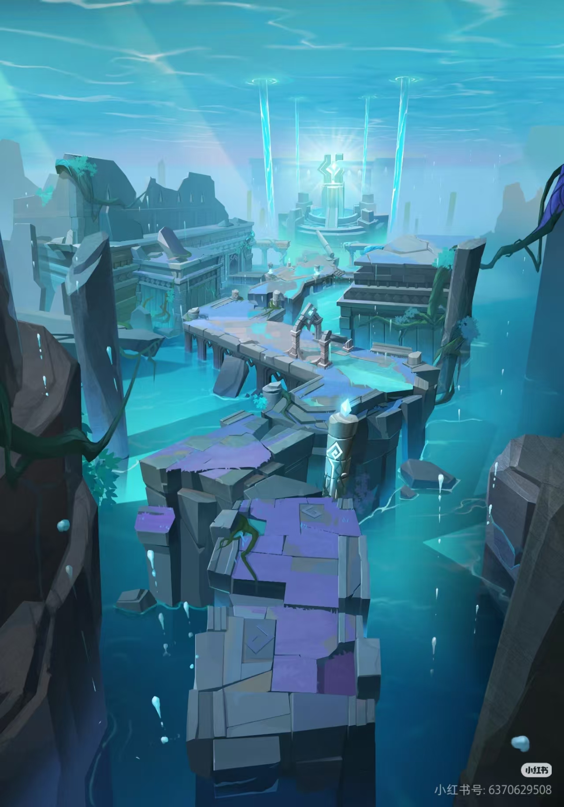
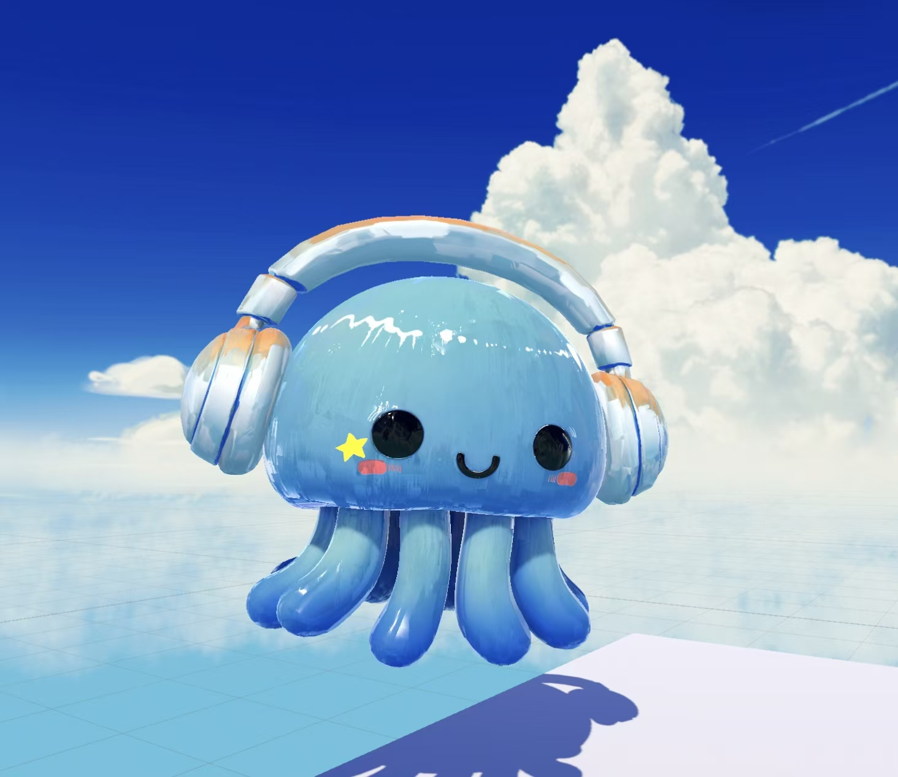
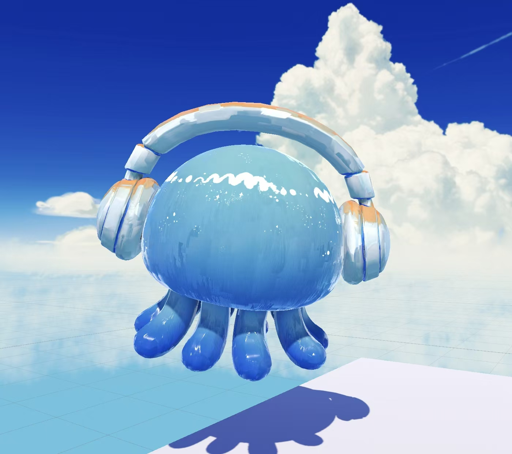
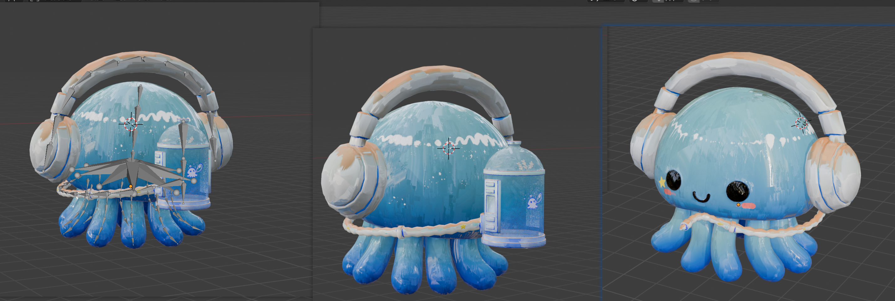
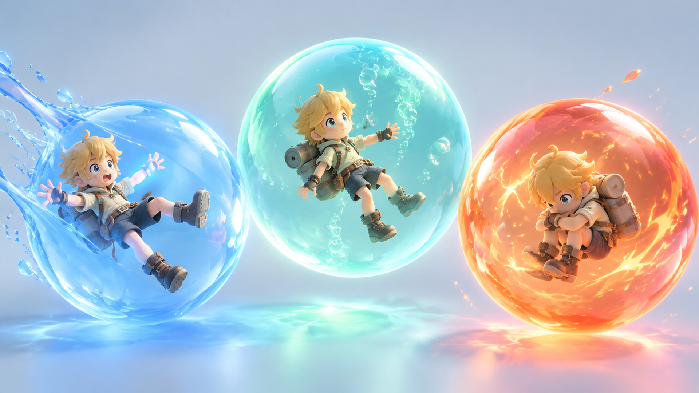
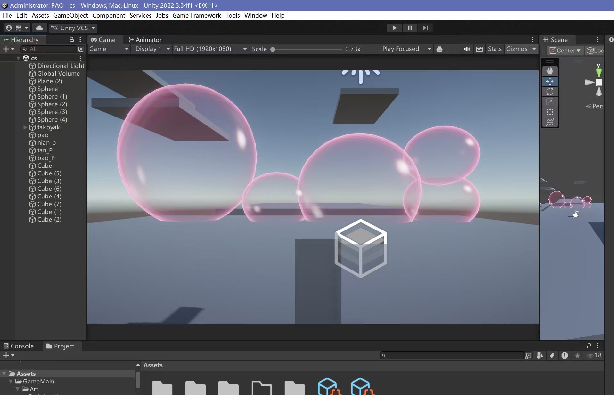

# 美术需求

> **版本 v2.27** ｜ 2026-10-11 ｜ 从 [04-完整策划案.md](04-完整策划案.md) 提取整合
>
> **本文档是给美术同学的需求说明**——策划案里所有与美术相关的内容都汇总于此。
>
> **v2.26 同步范围**：前三关规范见主稿 §8.4 / §8.5 / §8.6，能力与资源规则见 §6，失败、返回与存档见 §15，主角形象见 §5。主稿路径不变；本文只同步相关表现，不扩展重画与本次无关的旧美术方案。

### 本次术语与制作边界

- **泡泡体**是统称；**粉色泡泡（墙）**是可破坏、会恢复的障碍；**诞生泡泡体**对应初始存档。
- 文案统一使用**弹力泡泡、浮力泡泡、黏合能力、爆炸泡泡、泡泡液**。旧“浮粘”仅保留为既有图稿/资产名称别名，旧“泡泡值”仅为旧 UI 数值名；既有图片路径不变。
- **泡泡液有限**：回收普通已发射泡泡返还液体；爆炸泡泡不可回收，爆炸消耗不返还，但该消耗随时间慢回复。粉色障碍恢复与泡泡液回复必须分开表达，不得画成“破坏障碍返还资源”。
- 前三关**房间以白色为主，只放少量交互类型**，可通过远景/缝隙窥见记忆世界。旧粉紫水下参考保留为远景及第 4/5 关方向，不作为第 2/3 关房间主色定案。
- 教学顺序统一为**限制行动 → 玩家操作 → 反馈 → 命名 → 自由**。以行为反馈为主，反馈后允许简短命名提示，不是绝对零文字；泡泡潮只保留为后置扩展，不是第三关必验收内容，不得先于核心教学加入时间压力。
- 资源归零仅为**资源不足/行动受限，不是死亡**；玩家应可回收存量普通泡泡或等待爆炸消耗慢回复，不得用“永久死亡/只能重开”视觉暗示。主动重开仍可作为可选菜单操作。
- 资产预算沿用现有清单，通过补状态与复用素材覆盖本次需求，不在此新增具体预算数值。未定操作与数值见第十二章，旧候选不作最终制作/验收依据。

---

## 一、整体风格

### 1.1 画风

| 项 | 要求 |
|----|------|
| 画风 | **手绘厚涂** |
| 维度 | **3D**（角色可用 2D 立绘） |
| 统一原则 | **一切皆泡泡** |

### 1.2 手绘厚涂的视觉特征

| 项 | 要求 |
|----|------|
| 笔触 | **可见的手绘笔触**，不追求平滑 |
| 质感 | 颜料堆积感、色彩交融、边缘柔和 |
| 光影 | 柔和的体积感，非硬边赛璐璐 |
| 线条 | **弱化描边** |
| 氛围 | 温暖、朦胧、有"手作感" |

> **参考**：《明日方舟》「火山旅梦」活动的 CG 质感。

### 1.3 当前折中方案

> ⚠️ **角色本体保留现有设计（含描边），场景背景采用厚涂风格。**
>
> 这是阶段性方案——角色设计已成熟，暂不重画。
> 若后续需要统一，可再调整。

---

## 二、色彩规范

### 2.1 主色板

**前三关房间以白色为主**，粉 / 紫 / 青用于少量交互对象、对比和记忆远景；旧“粉紫为基调，青为对比”保留为水下参考及第 4/5 关美术方向，不作为第 2/3 关房间主色定案。

| 色名 | 色号 | 环境用途 | **泡泡体 / 泡泡墙用途** |
|------|------|---------|------------------------|
| **云白** | `#FAF6F8` | 前三关房间主体、呼吸空间 | 基础环境，不等同于空资源或死亡 |
| **云粉** | `#F5C6D8` | 光晕、少量强调 | **粉色泡泡（墙）：可破坏、会恢复障碍** |
| **雾紫** | `#B48BC4` | 记忆远景、梦幻感 | 既有不可破坏墙配色参考，不要求前三关铺满 |
| **水青** | `#7ED4D4` | 冷调对比 | 既有弹性墙配色参考 |

### 2.2 扩展色板

以下沿用既有色号与素材用途；扩展类型不因列入色板而自动成为前三关制作项。

| 色名 | 色号 | 环境用途 | **泡泡墙用途** |
|------|------|---------|---------------|
| **霞粉** | `#FFE0EC` | 高光、云层 | 粉色泡泡（墙）高光面 |
| **藕荷** | `#D9A8D0` | 粉紫过渡 | 粉色泡泡（墙）阴影面 |
| **深紫** | `#6B5B8C` | 远景、阴影 | 不可破坏墙阴影面 |
| **夜紫** | `#4A3F6B` | 最深处、深渊 | **空洞 / 虚空边界** |
| **暖橙** | `#FFB87C` | 暖光、强调点 | **爆炸陷阱的警示参考** |
| **珊瑚** | `#FF9E9E` | 珊瑚元素 | 既有脆弱墙配色参考 |
| **深海青** | `#3A8FA0` | 水下阴影 | 弹性墙阴影面 |

### 2.3 配色逻辑

```
白色主体           →  前三关简洁房间，突出少量交互
粉色障碍           →  可破坏、会恢复
冷色能力对比       →  区分弹力 / 浮力与黏合表现
暖色警示           →  爆炸陷阱、需谨慎
粉紫水下远景       →  窥见记忆世界，不覆盖房间主色
```

> **设计要点**：颜色与材质动态共同帮助识别；不可只靠颜色区分功能。操作反馈优先，随后可出现简短命名提示。

---

## 三、泡泡墙材质配色表

> 粉色泡泡（墙）的可破坏、会恢复属性为本次确认；其余既有墙体类型保留参考，不代表前三关全部启用。

| 材质 | 主色 | 色号 | 特征 | 玩法 / 制作边界 |
|------|------|------|------|----------------|
| **粉色泡泡（墙，旧称普通墙）** | 云粉 | `#F5C6D8` | 半透明粉，柔和 | 可破坏，会恢复；恢复时间 TBD |
| **不可破坏墙** | 雾紫 | `#B48BC4` | 深紫，厚重感 | 既有关卡边界参考 |
| **弹性墙** | 水青 | `#7ED4D4` | 半透明青，有弹性 | 既有弹跳/穿过表现参考，不等同于玩家的弹力泡泡 |
| **爆炸墙** | 暖橙 | `#FFB87C` | 橙色，有脉动感 | 既有“靠近/触碰爆炸”方案为待确认旧候选；第三关采用爆炸陷阱表现，不据此锁定触发操作 |
| **脆弱墙** | 珊瑚 | `#FF9E9E` | 浅珊瑚色，有裂纹 | “一碰就碎、不愈合/永久破坏”为待确认旧候选，不应用于粉色泡泡（墙） |
| **虚空/深渊** | 夜紫 | `#4A3F6B` | 近黑紫，无底感 | 第 2/3 关空洞用作失败返回区域，不画成掉入即永久死亡 |

### 恢复过程的表现

**粉色障碍恢复不是关卡重置，是愈合**——需要**让玩家看得见这个过程**。

```
破坏后的粉色泡泡（墙）
     ↓  ① 分裂      墙体裂成小块
     ↓  ② 膨胀      向外弥散，填补空隙
     ↓  ③ 融合      重新结合成完整墙体
   恢复完成
```

> **美术要点**：障碍愈合与“普通已发射泡泡回收、液体回流水母本体”用不同目标、运动方向和收束反馈区分。恢复时长 TBD，不提前锁定具体秒数；“破坏回复泡泡液”是待确认旧候选，不是本次规则。

---

## 四、场景设计

### 4.1 地图结构：箱庭

| 项 | 内容 |
|----|------|
| 结构 | **箱庭**（Diorama / 微缩景观） |
| 视角 | **斜俯视**（既有机位参考）；第 1 关开场固定视角、限制移动，破坏第一粉色泡泡后解锁自由移动 |
| 边界 | 每关是独立的封闭空间；返回点与重置范围按主稿 §15，精确配置 TBD |

```
┌─────────────────┐
│   ╭─────────╮   │  ← 箱庭边界（泡泡膜）
│   │ 白色房间│   │
│   │    ◆    │   │      ◆ 玩家
│   ╰─────────╯   │  ← 缝隙 / 远景可窥见记忆世界
└─────────────────┘
```

### 4.2 场景演进

| 关卡 | 场景与教学视觉重点 |
|------|--------------------|
| **第 1 关** | **白色空间**；诞生泡泡体/初始存档、第一粉色障碍、少量弹力对象。先展示行动限制，再用第一次破坏反馈解锁自由移动 |
| **第 2 关** | **白色房间**；巨大空洞、顶部黏合群，突出可拼接的连接体与自制通关工具；浮力泡泡达到大小阈值后包裹角色飞行 |
| **第 3 关** | **白色房间**；已有飞行能力，存在大量定向移动泡泡实体，但交互类型保持少量；爆炸陷阱可将玩家推向空洞，突出组合物理与力方向/大小反馈 |
| **第 4/5 关方向** | 保留旧海洋水下 / 水底与粉紫参考，作为后续记忆世界方向，不覆盖前三关房间主色 |

### 4.3 海洋元素清单

前三关优先用于远景、缝隙外的记忆世界；不以装饰和交互类型堆满教学房间。

| 元素 | 用途 |
|------|------|
| **珊瑚** | 装饰、平台、障碍的既有参考 |
| **海草** | 动态装饰、可穿过的既有参考 |
| **水泡** | 上升气流、视觉引导 |
| **光线** | 水下体积光、氛围 |
| **岩石** | 地形、掩体的既有参考 |
| **贝壳 / 海星** | 点缀、可交互物的既有参考 |

### 4.4 参考图



*（整体基调参考；旧粉紫水下背景可沿用作远景及第 4/5 关方向）*



*（关卡场景参考——斜俯视箱庭，不作为第 2/3 关主色定案）*



**地编白盒参考**（当前阶段）：



*（水下遗迹结构——斜俯视纵深、石板平台、下方水面。颜色为白盒阶段，最终按粉紫基调调整。）*

*（地编同学参考图，不一定要做成这样）*

### 4.5 情绪演进（配色）

| 阶段 | 主色调 | 情绪 |
|------|--------|------|
| 1 | 云白为主 + 少量霞粉/交互色 | 空白、初醒 |
| 2 | 云白为主 + 少量交互色，粉紫水青记忆远景 | 探索、好奇 |
| 3 | 云白为主 + 少量交互色/暖色警示，记忆远景 | 组合、试探 |
| 4 | 深紫 + 夜紫 + 深海青（既有方向） | 压抑、坠落 |
| 5 | 回归 云粉 + 霞粉（既有方向） | 释然、回归 |

> **色彩也是莫比乌斯**：第 5 关呼应第 1 关的既有情绪构想保留；不据此把前三关白色主体改回粉紫。

### 4.6 前三关反馈链（主稿 §8.4 / §8.5 / §8.6）

| 关卡 | 行动与视觉反馈 | 命名 / 自由探索 |
|------|----------------|-----------------|
| **1** | 固定视角限制移动 → 玩家用弹力破坏第一粉色泡泡 → 障碍破裂、可通行空间与行动限制解除清晰可见 | 反馈后简短命名，再允许自由移动；弹力泡泡既是工具，也是粉色泡泡的前置材料 |
| **1（资源与蓄力）** | 破坏一定数量后提示泡泡液有限/回收前面发射的普通泡泡 → 回收动作、泡泡收束与液回流水母本体 → 资源增加；然后再教蓄力大小变化 | 回收触发数量、蓄力时间/力度曲线 TBD；不先用蓄力或资源耗尽迫使玩家重开 |
| **2** | 巨大空洞明确可见，顶部黏合群可识别 → 玩家拼接连接体、自制通关工具 → 显示连接成立、组合运动；浮力泡泡达到大小阈值后包裹并飞行 | 反馈后命名浮力泡泡/黏合能力，再开放工具试验；阈值与飞行控制 TBD，落入空洞返回房间初始点 |
| **3** | 以已有飞行为基础，定向移动泡泡/爆炸陷阱带来空洞风险 → 玩家组合物理 → 爆炸不返液、观察该消耗缓慢回复 → 大质量惯性甩飞 → 可控爆炸 → 大小相关向外力 | 各阶段先呈现反馈再命名；力 = f(大小)，精确曲线、爆炸触发操作 TBD；泡泡潮不是本关必验收 |

**存档与返回点表现**：诞生泡泡体作为初始存档需可识别，进入/存档建立给出低干扰反馈；第 2/3 关空洞失败返回房间初始点，返回过渡与落点反馈不得表现为永久死亡。返回点精确位置、重置范围及保存内容联动主稿 §15 待确认，不以画面直接暗示全关卡清空。

**力大小反馈**：复用拉伸、拖尾、涟漪与冲击范围表现，区分方向与相对强弱；大质量连接体的惯性、被甩飞与爆炸向外力应可读。表现由实际物理参数驱动，不以“统一 2 倍”或固定力度替代 f(大小)。

---

## 五、角色设计

> ⚠️ **v2.26 形象重设**：半透明蓝色**果冻水母 + 头戴式大耳机**，取代旧“蓝色水母 + 储泡泡液罐”。以下以新形象为准；旧三视图、Spine 图稿仅作参考留档。

### 5.1 两种呈现形式

| 形式 | 用途 | 说明 |
|------|------|------|
| **游戏内** | 实际游玩 | 蓝色果冻水母，圆润 Q 版，半透明材质 |
| **人形立绘** | 剧情演出、菜单、宣传 | 是否保留待确认；需延续耳机、星星、果冻质感 |

### 5.2 v2.26 游戏内形象（正 / 背面）




**游戏内 3D 形象**（模型师当前稿）：



*（左：背面 / 中：侧面 / 右：正面）*

| 项 | 规格 |
|----|------|
| 造型 | 圆顶状头部 + **6 条**圆润触手；饱满软糖轮廓，头大身小 |
| 材质 | **半透明果冻**：光线可穿透，内部由浅青蓝到深蓝渐变；表面液体波纹高光 |
| 耳机 | **大号头戴式耳机**，透明果冻材质（浅蓝白）；头梁顶部、耳罩外侧有**橙色涂装**；与头部同为果冻材质语言 |
| 面部 | 两个大圆黑豆眼（高光）、固定黑色弯月微笑 |
| 贴纸 / 腮红 | 左眼下方**黄色五角星贴纸**；两颊粉色涂抹状腮红 |
| 配色占比 | 蓝为主色；橙色仅耳机，黄色星星、粉色腮红为小面积点缀 |
| 形变 | 运动、受击、蓄力时允许果冻般挤压回弹，保持通透高光 |

> **储罐已移除**：旧“糖果色储液罐 + 绑带 + 软管”不再制作；泡泡液承载方式见主稿 §15 **D10**。

### 5.3 人形立绘设定（待确认）

| 项 | 更新后的方向 |
|----|--------------|
| 定位 | 同一角色的另一种呈现 |
| 保留元素 | 水母伞盖 → 发型/头饰；**耳机 → 随身配饰**；星星贴纸、腮红保留 |
| 配色 | 蓝/青为主，橙色点缀 |
| 用途与气质 | 剧情演出、主菜单、宣传物料；是否制作由团队确认 |

### 5.4 建模与旧三视图

**建模要点**：果冻半透明材质（折射/次表面感）、6 条触手的摆动与渐变、耳机分件（头梁可微晃）、背部无面部元素。

下列旧三视图基于 v2.15 形象（5 条触手 + 储罐），**仅作姿势与分镜参考**，外观不再沿用：

| 旧图稿 | 路径 |
|--------|------|
| 弹力 不蓄力 / 蓄力 | images/character/bounce-idle-3view.png · bounce-charge-3view.png |
| 浮粘 不蓄力 / 蓄力 | images/character/sticky-idle-3view.png · sticky-charge-3view.png |
| 蓄力漂浮 / 泡泡空间漂浮 | images/character/float-charge-3view.png · float-space-3view.png |
| 爆炸 不蓄力 / 蓄力 | images/character/bomb-idle-3view.png · bomb-charge-3view.png |

### 5.5 表情与蓄力反馈（需按新形象调整）

新形象面部为固定弯月嘴 + 豆豆眼，**旧稿“鼓腮、五官大幅变化”的表情差分不再直接适用**。蓄力与状态反馈优先依靠：

| 反馈来源 | 表现 |
|----------|------|
| 果冻形变 | 头部、触手随蓄力/受击挤压、拉伸、回弹 |
| 高光与气泡 | 表面波纹高光流动，内部小气泡聚集 |
| 耳机 | 轻微震动、耳罩光感变化 |
| 眼睛 | 高光变化（方向/数量），保持豆豆眼轮廓 |

> 旧表情差分图（images/character-expression-chart.png 及 §5.6 原则）保留“可爱努力、不丑化”的方向；具体表现重做，待确认。

### 5.6 表情红线（原则保留）

搞笑来自果冻形变与可爱反应，不来自丑化：不爆青筋、不眼球凸出、不脸色发紫发黑、不五官扭曲。

### 5.7 部件拆分（待按新形象更新）

| 部件 | 数量 | 说明 |
|------|------|------|
| 头部 | 1 | 果冻主体，含面部 |
| 眼睛 | 2 | 黑豆眼（高光独立） |
| 嘴巴 | 1 | 弯月微笑 |
| 腮红 | 2 | 含星星贴纸可独立 1 件 |
| 触手 | **6** | 独立摆动 |
| 耳机 | 1 套 | 头梁 + 两耳罩可分件 |

旧 Spine 图稿（images/character/spine-parts.png，13 部件含储罐/软管/5 触手）仅作拆分思路参考，不沿用部件构成。

---

## 六、泡泡空间表现

### 6.1 三种泡泡的视觉区分

| 泡泡 | 颜色 | 内部特征 | 角色姿态 |
|------|------|---------|---------|
| **弹力泡泡** | 蓝 | 表面有弹性拉伸形变 | 被弹射出去 |
| **浮力泡泡** | 青绿 | 内壁有上升的气泡，失重感；黏合能力用接触处连接反馈区分 | 达到大小阈值后被包裹飞行，阈值/飞行控制 TBD |
| **爆炸泡泡** | 橙红 | 能量涌动、碎块翻腾 | 抱膝防御的既有姿态参考 |

> **区分原则**：靠**颜色 + 内部动态**区分，不靠形状（形状统一为球体）。
> 玩家一眼就能判断这是哪种泡泡。



### 6.2 世界层泡泡（初版）



*（Unity 中的初版可破坏泡泡，尚未美术加工）*

---

## 七、动画需求

> ⚠️ **动画是本作的大项**——几乎每个交互都需要动画反馈。
>
> 核心原则：**反馈优先于文字**——玩家一操作，世界立刻有反应。

### 7.1 角色动画（水母主角）

#### 基础动作

| 动画 | 说明 |
|------|------|
| **待机** | 呼吸起伏 + 触手缓慢飘动（循环） |
| **移动** | 左右移动，身体微微倾斜 |
| **跳跃** | 起跳蓄力 → 上升 → 下落 → 落地缓冲 |
| **转向** | 左右转身 |

#### 能力动作

| 动画 | 说明 |
|------|------|
| **蓄力** | 果冻形变——**分阶段**（小/中/大，对应蓄力量）；时间/力度曲线 TBD |
| **吐泡泡** | 释放瞬间 |
| **回收普通泡泡** | 回收动作 → 目标普通已发射泡泡收束 → 液体沿可读路径回流水母本体；操作方式待定，不表现爆炸泡泡可回收 |
| **被泡泡包裹飞行** | 浮力泡泡达到大小阈值 → 包裹成立 → 触手舒展；阈值与飞行控制 TBD |
| **泡泡空间漂浮** | 失重漂浮，触手自然舒展 |
| **初始限制解除** | 第一粉色障碍破坏后，限制状态解除与可移动空间变化即时可见 |
| **受力 / 惯性甩飞** | 随实际方向与强弱表现形变、倾斜、拖尾，区分大质量惯性与爆炸向外推力 |

#### 状态动作

| 动画 | 说明 |
|------|------|
| **受伤 / 被击退** | 受冲击的既有表现参考，不把资源不足当成受伤 |
| **资源不足 / 受限** | 水母本体/HUD 空状态与无法发射反馈；角色仍可行动、回收或等待，不采用灰化/透明“软死亡”姿态（见 9.3） |
| **空洞失败返回** | 简短回退过渡 → 房间初始点出现，保留可重试感；重置范围 TBD |
| **消散** | 结局时的既有消散；不用于资源归零 |

---

### 7.2 泡泡墙动画 ⭐

> **重点：要有"泡泡"的质感——柔软、有弹性、半透明，不是石头碎裂。**

#### 破裂（分裂）

```
① 撞击瞬间  →  接触点出现涟漪 / 高光
② 裂纹      →  从撞击点扩散（像水面裂开）
③ 分裂      →  碎成小块        ← 呼应规则①
④ 飞散      →  小块向外弹开，带弹性
⑤ 残留      →  小碎块飘浮，慢慢消散
```

#### 愈合（恢复）

```
① 触发      →  周围泡泡开始反应
② 膨胀      →  碎片向外弥散、填补空隙  ← 呼应规则③
③ 融合      →  碎片聚合              ← 呼应规则②
④ 完成      →  表面恢复，"啵"地收束
```

> 💡 **这两段动画本身就是教学**——
> 玩家操作后先看到反馈，再允许出现简短命名提示；不以大段文字代替反馈，也不要求绝对零文字。粉色障碍恢复时间 TBD。

#### 各材质的特殊动画

| 材质 | 动画 |
|------|------|
| **粉色泡泡（墙，旧称普通墙）** | 破裂、愈合、被撞反馈；弹力既作工具，也关联粉色障碍前置材料教学 |
| **弹性墙** | 被撞时**形变回弹**、穿过时的涟漪（既有参考） |
| **脆弱墙** | 既有“一碰即碎、不愈合/永久破坏”动画保留为待确认旧候选，不用于粉色障碍 |
| **爆炸墙 / 爆炸陷阱** | **待机脉动**（危险预警）→ 爆炸向外受力反馈；具体触发操作/时序 TBD |
| **不可破坏墙** | 撞击无变化，但有“撞不动”的反馈（既有参考） |

---

### 7.3 泡泡动画（玩家发射的）

| 阶段 | 动画 |
|------|------|
| **发射** | 从角色口中/手中飞出 |
| **飞行** | 空中轨迹、拖尾 |
| **落点预览** | 引导线末端的落点标记 |
| **落地 / 放置** | 轻轻落地、微微弹动 |
| **弹射**（弹力泡泡） | 被撞击后弹开，显示受力方向/相对强弱 |
| **漂浮 / 包裹飞行**（浮力泡泡） | 上升感；达到大小阈值后包裹角色飞行，阈值/控制 TBD |
| **黏合 / 连接体**（黏合能力） | 接触处连接成立、组合整体受力；“自动黏合/粘后失飞”仅待确认旧候选，不据此定动作 |
| **回收普通泡泡** | 普通已发射泡泡收束 → 液回流水母本体 → HUD 资源增加；回收效率 TBD |
| **引爆**（爆炸泡泡） | 可控爆炸、向外冲击 = f(大小)；触发操作与力曲线 TBD，倒计时闪烁只保留为待确认旧表现候选 |
| **爆炸消耗慢回复** | 无目标泡泡回流，水母本体/HUD 持续缓慢补液；与回收返还、即时消耗可区分 |
| **自动消散** | 既有透明消失表现参考；消散不等同于回收，不暗示自动返液 |

---

### 7.4 泡泡潮动画（后置扩展，非第三关必验收）

旧方案及资产方向保留；核心教学完成前不加入时间压力，不为前三关强制制作或验收。

| 动画 | 说明 |
|------|------|
| **扩散** | 从角落蔓延的推进感 |
| **分裂增殖** | 不断生出新泡泡 |
| **被破坏** | 打掉一块，但周围继续长 |
| **逼近** | 靠近玩家时的压迫感 |

> **设计要点**：要让玩家**直观感受到"它在逼近"**——
> 不是屏幕上的数字，而是**看得见的威胁**。

---

### 7.5 环境动画

| 元素 | 动画 |
|------|------|
| **水下光线** | 体积光缓慢流动 |
| **海草** | 随水流摆动 |
| **珊瑚** | 轻微呼吸感 |
| **水泡** | 持续上升 |
| **记忆残影** | 浮现 → 停留 → 消散 |
| **深渊** | 吞噬感、缓慢涌动 |

---

### 7.6 UI 动画

| 元素 | 动画 |
|------|------|
| **泡泡液指示**（旧 UI 数值名：泡泡值） | 即时消耗、回收返还、爆炸消耗慢回复三种变化可区分，不把障碍愈合当成资源回复 |
| **蓄力指示** | 随蓄力增长，时间/力度曲线 TBD |
| **泡泡切换** | 切换时的转场；按教学进度展示能力 |
| **记忆文字** | 浮现 → 停留 → 淡出 |
| **资源不足提示** | 短暂强调可回收/可等待，不出现强制重开或死亡提示 |
| **初始存档 / 返回点** | 诞生泡泡体存档建立、空洞返回落点的低干扰确认 |
| **教学命名** | 操作反馈后简短出现，随后让出自由探索空间 |

---

### 7.7 叙事动画

| 动画 | 说明 |
|------|------|
| **关卡开场** | 进入新关卡的过渡 |
| **记忆触发** | 记忆显现的演出 |
| **结局** | **放弃记忆的消散**（全作高潮） |

---

### 7.8 动画清单速查表

> **给动画师的完整清单**——按类别列出，可直接用作排期依据。

#### A. 角色动画（水母主角）

| # | 动画 | 优先级 | 备注 |
|---|------|--------|------|
| A1 | **待机（呼吸+触手飘动）** | 🔴 P0 | 最基础，循环播放 |
| A2 | **走路 / 移动** | 🔴 P0 | 身体微微倾斜 |
| A3 | **完整转向** | 🔴 P0 | 左右转身 |
| A4 | **跳跃 / 漂浮** | 🔴 P0 | 起跳→上升→下落→落地缓冲 |
| A5 | **蓄力（分阶段）** | 🔴 P0 | 果冻形变，小/中/大三档 |
| A6 | **吹泡泡** | 🔴 P0 | 释放瞬间 |
| A7 | **进入泡泡空间** | 🟠 P1 | 进入动作 |
| A8 | **出泡泡** | 🟠 P1 | 离开动作 |
| A9 | **被泡泡带着起飞** | 🟠 P1 | 包裹飞行 |
| A10 | **回收泡泡** | 🟠 P1 | 液体回流本体 |
| A11 | **受力 / 惯性甩飞** | 🟠 P1 | 形变、倾斜、拖尾 |
| A12 | **受伤 / 被击退** | 🟡 P2 | |
| A13 | **资源不足（受限）** | 🟡 P2 | 不放泡泡，但仍可动 |
| A14 | **空洞失败返回** | 🟡 P2 | 回退过渡 |
| A15 | **消散（结局）** | 🟢 P3 | 全作高潮 |

#### B. 泡泡墙动画 ⭐ 重点

| # | 动画 | 优先级 | 备注 |
|---|------|--------|------|
| B1 | **破裂（分裂）** ⭐ | 🔴 P0 | 涟漪→裂纹→碎块→飞散→消散 |
| B2 | **愈合（恢复）** ⭐ | 🔴 P0 | 弥散→聚合→"啵"收束 |
| B3 | **弹性墙形变回弹** | 🟠 P1 | 被撞时 |
| B4 | **爆炸墙待机脉动** | 🟠 P1 | 危险预警 |
| B5 | **不可破坏墙"撞不动"** | 🟡 P2 | 撞击反馈 |
| B6 | **被撞反馈**（通用） | 🟠 P1 | 所有墙体的基础反馈 |

> 💡 **B1/B2 是最重要的动画**——它本身就是教学，玩家看完就懂三条规则。

#### C. 泡泡动画（玩家发射的）

| # | 动画 | 优先级 | 备注 |
|---|------|--------|------|
| C1 | **发射** | 🔴 P0 | 从口中飞出 |
| C2 | **飞行 / 拖尾** | 🟠 P1 | 空中轨迹 |
| C3 | **落点预览** | 🟠 P1 | 引导线末端标记 |
| C4 | **落地 / 放置** | 🟠 P1 | 轻轻弹动 |
| C5 | **弹射**（弹力） | 🟠 P1 | 被撞弹开 |
| C6 | **漂浮 / 包裹飞行**（浮力） | 🟠 P1 | 上升感 |
| C7 | **黏合 / 连接体** | 🟠 P1 | 接触处连接成立 |
| C8 | **引爆**（爆炸） | 🟠 P1 | 向外冲击 |
| C9 | **自动消散** | 🟡 P2 | 透明消失 |

#### D. 泡泡潮动画（后置扩展）

| # | 动画 | 优先级 | 备注 |
|---|------|--------|------|
| D1 | **溢出 / 扩散** | 🟡 P2 | 从角落蔓延 |
| D2 | **分裂增殖** | 🟡 P2 | 不断生出新泡泡 |
| D3 | **被破坏** | 🟡 P2 | 打掉一块 |
| D4 | **逼近** | 🟡 P2 | 压迫感 |

> ⚠️ **后置扩展**——核心教学完成前不加入时间压力。

#### E. 环境动画

| # | 动画 | 优先级 |
|---|------|--------|
| E1 | 水下光线（体积光流动） | 🟡 P2 |
| E2 | 海草摆动 | 🟡 P2 |
| E3 | 珊瑚呼吸 | 🟡 P2 |
| E4 | 水泡上升 | 🟡 P2 |
| E5 | 记忆残影（浮现→停留→消散） | 🟡 P2 |
| E6 | 深渊涌动 | 🟡 P2 |

#### F. UI 动画

| # | 动画 | 优先级 |
|---|------|--------|
| F1 | 泡泡液指示（消耗/返还/慢回复） | 🔴 P0 |
| F2 | 蓄力指示 | 🔴 P0 |
| F3 | 泡泡切换 | 🟠 P1 |
| F4 | 记忆文字（浮现→淡出） | 🟠 P1 |
| F5 | 资源不足提示 | 🟡 P2 |
| F6 | 初始存档 / 返回点 | 🟡 P2 |
| F7 | 教学命名 | 🟡 P2 |

#### G. 叙事动画

| # | 动画 | 优先级 |
|---|------|--------|
| G1 | 关卡开场 | 🟢 P3 |
| G2 | 记忆触发 | 🟢 P3 |
| G3 | 结局（放弃记忆的消散） | 🟢 P3 |

---

### 7.9 动画优先级

| 优先级 | 动画 | 理由 |
|--------|------|------|
| 🔴 **P0** | 粉色泡泡墙破裂/愈合、角色蓄力/吐泡泡、初始限制解除、普通泡泡回收/液回流与资源状态 | **核心反馈**，需先验证资源闭环与第一关教学 |
| 🟠 **P1** | 泡泡发射/落地、弹射、浮力包裹飞行、黏合连接体、力大小/爆炸反馈、存档/返回点 | 前三关主要交互反馈 |
| 🟡 **P2** | 环境动画、非核心 UI 动画；泡泡潮仅作后置扩展 | 氛围与体验，不先于核心教学加时间压力 |
| 🟢 **P3** | 叙事动画、过场 | 打磨阶段 |

> **建议**：P0/P1 用简单动画先跑通，**验证手感后再精修**。

---

## 八、记忆反馈表现

**克制原则**：不弹窗、不打断、不用大段文字。

| 反馈类型 | 表现 |
|---------|------|
| **残影** | 浮现半透明人影，数秒后消失 |
| **声音** | 环境音变化，或一句极轻的旁白 |
| **画面** | 色调微变、光晕 |
| **文字** | **最多一句**，出现在画面边缘 |

---

## 九、UI 交互稿

> ⚠️ **本章为 UI 设计稿**——供 UI 美术同学直接使用。

### 9.0 设计基调

| 项 | 内容 |
|----|------|
| 统一原则 | **一切皆泡泡**——所有 UI 元素都用泡泡形态 |
| 整体风格 | 极简、低干扰、半透明 |
| 配色 | 沿用主色板（云粉 / 雾紫 / 水青） |
| 交互哲学 | **能不用 UI 就不用**——让世界本身当界面 |

---

### 9.1 游戏内 HUD

#### 布局总览

```
┌─────────────────────────────────────────┐
│  ◯◯◯         [临时提示文字]             │  ← 记忆 / 反馈后简短命名
│                                         │
│                                         │
│              ◆ 玩家                      │
│                                         │
│                                         │
│  ◉ 泡泡液                    ①②③       │  ← 资源 + 按教学进度展示的能力
└─────────────────────────────────────────┘
```

**极简原则**：默认只有**泡泡液指示**常驻，其余临时出现。旧“泡泡值”仅保留为旧 UI 数值名，玩家文案用“泡泡液”；显示格式与液上限不由旧稿确定。

#### 元素详解

**① 泡泡液指示器**（左下，常驻；旧 UI 数值名：泡泡值）

```
        ╭─────────╮
        │  ◉◉◉◉◉  │   泡泡串满状态示意
        │  ◉◉○○○  │   部分填充示意
        ╰─────────╯
```

> 上图沿用旧 UI 的五段示意，不代表液上限为 5、当前液量为 2 或固定发射次数；实际液上限、回收效率 TBD，串/条形式待确认。

| 项 | 设计 |
|----|------|
| 形态 | 沿用**小泡泡串**候选，可用内部液面表达连续量；串/条仍待确认 |
| 位置 | 左下角 |
| 满值 | 泡泡串全满，微微发光；映射实际泡泡液，不暗示固定枚数 |
| 消耗 | 发射时即时减液/收缩；爆炸消耗不返还，爆炸泡泡无回收返还态 |
| 回收返还 | 普通已发射泡泡收束、液回流水母本体后，指示器同步增加；不与粉色障碍恢复混淆 |
| 慢回复 | 爆炸消耗随时间缓慢补液，连续柔和变化、无目标回流；与即时消耗和回收返还可区分 |
| 低资源 | 水母本体/指示器低液位轻微脉动，可提示回收或等待；不做死亡警报 |
| 归零 | 指示器空液态，但角色仍可回收/等待；不灰化角色，不强制弹重开 |

**② 蓄力指示器**（第 1 关回收教学后再教蓄力；蓄力时出现，跟随角色）

```
        角色头顶
           ↓
        ╭─────╮
        │ ◯   │   ← 泡泡从小变大
        ╰─────╯
        ▓▓▓▓░░░░  ← 蓄力进度
```

| 项 | 设计 |
|----|------|
| 位置 | 跟随角色（头顶） |
| 形态 | **一个正在变大的泡泡** |
| 进度 | 泡泡大小随蓄力变化；时间/力度曲线 TBD，不以线性关系或固定秒数定案 |
| 消耗预览 | 旁边显示预计泡泡液消耗；爆炸消耗量 TBD |
| 满蓄力 | 泡泡微微发光/脉动 |
| 力大小反馈 | 预览/实际冲击范围与拖尾可表达相对强弱，向外力 = f(大小)；不锁定“2 倍” |

> **设计要点**：果冻形变 + 泡泡大小双通道反馈；按实际参数驱动，不提前锁定旧数值。

**③ 泡泡切换**（切换时短暂出现）

```
         ╭─────────────────────╮
         │  ①弹力  ②浮力  ③爆炸 │
         ╰─────────────────────╯
              ▲ 当前选中
```

| 项 | 设计 |
|----|------|
| 位置 | 底部中央 |
| 形态 | 沿用三个泡泡图标预算，按教学进度展示，当前选中的放大 |
| 出现 | 切换时淡入，2 秒后淡出（既有 UI 动效参考） |
| 图标 | 弹力=蓝 / 浮力=青 / 爆炸=橙；黏合能力用连接反馈补充，旧“浮粘”仅是图稿/资产名别名 |

**④ 爆炸泡泡状态**（有爆炸泡泡时出现）

```
         ╭──────────╮
         │  ● 在场   │   ← 状态示意，不代表单枚上限
         ╰──────────╯
```

| 项 | 设计 |
|----|------|
| 位置 | 右下角 |
| 形态 | 复用既有爆炸泡泡图标 |
| 作用 | 表示爆炸泡泡在场、不可回收与可控爆炸；爆炸触发操作 TBD，不预写 F 引爆 |
| 旧候选 | “一次只能一枚 / F 引爆 / 5 秒倒计时”等为待确认旧候选，不作为状态图最终限制 |

**⑤ 记忆文字**（记忆触发时）

```
┌─────────────────────────────────────────┐
│                                         │
│                                         │
│           「你以前睡在这里。」            │  ← 画面中下，淡淡浮现
│                                         │
└─────────────────────────────────────────┘
```

| 项 | 设计 |
|----|------|
| 位置 | 画面中下 |
| 字体 | 手写感 / 柔和 |
| 出现 | 淡入 → 停留 3 秒 → 淡出 |
| 数量 | **一次最多一句**（克制原则） |

**⑥ 教学 / 存档临时反馈**：先让玩家操作、看到世界反馈，再简短命名“弹力泡泡 / 回收 / 浮力泡泡 / 黏合能力 / 爆炸泡泡”。初始行动限制解除、诞生泡泡体存档建立、空洞返回落点用低干扰反馈；不以长教程或强制弹窗替代行为，不以泡泡潮时间压力推进前三关。

---

### 9.2 瞄准与落点预览

> ⚠️ **这是最重要的交互反馈**——玩家必须知道泡泡会落在哪。

#### 引导线

```
        角色
         ↓
        ◆ ┄┄┄┄┄┄┄┄┄○      ← 虚线抛物线
                      ↑
                   落点标记
```

| 元素 | 设计 |
|------|------|
| **虚线** | 从角色发出的抛物线，**泡泡形态的小点**组成 |
| **落点标记** | 一个**脉动的空心泡泡圈** |
| **颜色** | 跟随当前泡泡类型（蓝/青/橙） |
| **蓄力影响** | 泡泡大小、抛射落点与预计力度随实际蓄力参数变化；时间/力度曲线 TBD，旧“蓄力越久越远越大”保留为待确认表现候选 |

#### 落点有效性

```
有效落点         无效落点
   ◎               ⊘
 （实心脉动）      （红色叉号）
```

| 状态 | 表现 |
|------|------|
| **可放置** | 空心泡泡圈，脉动 |
| **不可放置** | 变成**红色叉号**（如位置被占、超出范围） |

---

### 9.3 资源不足 / 受限提示（取代旧“软死亡”）

**泡泡液归零不是死亡，也不等同于关卡失败**。需要告诉玩家当前无法继续消耗液体，但仍能回收存量普通泡泡，或等待爆炸消耗随时间慢回复；不是只能重开。

```
┌─────────────────────────────────────────┐
│                                         │
│              角色保持可行动              │
│                                         │
│      「泡泡液不足，可回收普通泡泡。」      │
│      或「爆炸消耗正在慢慢回复。」          │
│                                         │
└─────────────────────────────────────────┘
```

| 元素 | 设计 |
|------|------|
| **角色** | 保持可行动，不变灰/透明，不采用永久死亡或无力瘫倒表现 |
| **水母本体 / HUD** | 空液态、发射受限反馈；有可回收目标时给回收反馈，有爆炸消耗时显示慢回复 |
| **文字** | 根据实际资源状态选择简短提示，不声称所有消耗都会自动回复，不打断行动 |
| **重开** | 暂停菜单保留主动重开选项，不在归零时强制重开、不将 R 重开作为唯一出口 |
| **空洞返回** | 第 2/3 关落入空洞返回房间初始点，按主稿 §15 处理；精确位置/重置范围 TBD，与资源不足提示分开 |

> 旧“角色灰化/透明 + 你过不去了 + 按 R 重开”稿保留为历史方案说明，**不用于本次资源归零验收**。

---

### 9.4 增值泡泡潮警示（后置扩展，非第三关必验收）

保留旧警示方案；不得先于核心教学加入时间压力。以下仅在后置扩展启用时适用。

泡泡潮逼近时需要**警示**，但不打断。

```
        屏幕边缘泛红/泛紫
        ┌─────────────────┐
        │▓▓▓▓▓▓▓▓▓▓▓▓▓▓▓▓│  ← 边缘脉动
        │▓▓             ▓▓│
        │▓▓     ◆      ▓▓│
        │▓▓             ▓▓│
        │▓▓▓▓▓▓▓▓▓▓▓▓▓▓▓▓│
        └─────────────────┘
```

| 距离 | 表现 |
|------|------|
| **远** | 无提示 |
| **中** | 屏幕边缘**轻微泛色** |
| **近** | 边缘**脉动加剧** + 轻微镜头震动 |
| **极近** | 边缘**强脉动** + 角色周围出现泡泡 |

> **设计要点**：用**屏幕边缘**表达威胁，不占用画面中央——
> 玩家还在专注解谜，**余光能感知到危险**。

---

### 9.5 菜单界面

#### 主菜单

```
        ╭─────────────────────────╮
        │                         │
        │         《泡涌》          │
        │       （泡泡形态标题）     │
        │                         │
        │      ◯ 开始游戏          │
        │      ◯ 继续              │
        │      ◯ 设置              │
        │      ◯ 退出              │
        │                         │
        ╰─────────────────────────╯
        背景：粉紫水下 + 缓慢漂浮的气泡
```

| 项 | 设计 |
|----|------|
| 标题 | **泡泡形态的字体**，或泡泡拼成的字 |
| 按钮 | **泡泡按钮**，hover 时微微膨胀 |
| 背景 | 粉紫水下场景 + 漂浮气泡（动态） |

#### 暂停菜单

```
        ╭─────────────────────────╮
        │                         │
        │        ◯ 继续            │
        │        ◯ 重开本关         │
        │        ◯ 设置            │
        │        ◯ 返回主菜单       │
        │                         │
        ╰─────────────────────────╯
        背景：游戏画面模糊 + 半透明遮罩
```

| 项 | 设计 |
|----|------|
| 遮罩 | 半透明，**不遮挡太多** |
| 按钮 | 泡泡按钮 |
| 呼出 | ESC |

#### 设置界面

| 分类 | 项 |
|------|-----|
| **音量** | 总音量 / 音乐 / 音效（滑块用泡泡串） |
| **画面** | 画质、全屏、分辨率 |
| **操作** | 键位重映射 |
| **辅助** | 字幕开关 |

> **设计要点**：滑块的"填充部分"用**泡泡串**表示——
> 和泡泡液指示器（旧 UI 数值名：泡泡值）保持一致的视觉语言。

---

### 9.6 UI 动效规范

| 元素 | 动效 |
|------|------|
| **出现** | 从中心**膨胀**出来（像吹泡泡） |
| **消失** | **收缩**然后"啵"地破掉 |
| **按钮 hover** | 微微**膨胀** + 发光 |
| **按钮点击** | 快速**收缩回弹** |
| **数值变化** | 沿用泡泡增减语言，但即时消耗、回收返还与爆炸消耗慢回复必须可区分 |

> **统一原则**：沿用“吹泡泡”的物理感；资源指示器的空态、补液态不是角色死亡。回收用液回流与同步增加，慢回复用连续柔和补液，不让所有变化都像泡泡爆破。

---

### 9.7 UI 资产清单

供 UI 美术同学制作；**沿用现有资产预算和数量，不新增具体预算**。本次反馈优先在既有指示器、图标、标记及动画中补状态/复用，存档与力反馈结合场景对象实现：

| 资产 | 数量 | 说明 |
|------|------|------|
| 泡泡液指示器（旧 UI 数值名：泡泡值） | 1 套 | 沿用满/中/低/空状态，补即时消耗/回收返还/爆炸消耗慢回复区分；归零无死亡暗示 |
| 蓄力指示器 | 1 套 | 分阶段（小/中/大）；参数 TBD，配合力大小反馈 |
| 泡泡图标 | 3 个 | 弹力/浮力/爆炸；旧“浮粘”仅为既有图稿/资产名称别名 |
| 爆炸泡泡状态图标 | 1 个 | 不可回收/在场/可控爆炸状态，操作与数量限制待确认 |
| 落点标记 | 2 个 | 有效/无效；复用状态表达回收目标与返回点引导，不增数量 |
| 引导线 | 1 套 | 虚线点；结合实际受力方向/大小使用 |
| 按钮 | 1 套 | 常态/hover/点击/禁用；重开仅可选 |
| 滑块 | 1 套 | |
| 遮罩 | 1 个 | 半透明；返回过渡不暗示永久死亡 |
| 字体 | 1 套 | 主字体 + 手写感字体（记忆文字用）；兼容反馈后简短命名 |

**场景/动作补状态**：回收动作与液回流、初始行动限制解除、诞生泡泡体初始存档与返回确认、连接体/包裹飞行、大小/惯性/向外力反馈，按 4.6、7.1、7.3 复用制作；不得擅自扩充前三关交互类型或锁定 TBD 数值。

---

### 9.8 ⚠️ 待确认

| # | 问题 |
|---|------|
| 1 | 泡泡液指示器（旧 UI 数值名：泡泡值）用**泡泡串**还是**长条**？必须可区分消耗/回收/慢回复 |
| 2 | 是否需要**小地图**（箱庭地图）？ |
| 3 | 记忆图鉴界面是否需要？ |
| 4 | 关卡选择界面？ |

---

## 十、音效需求

### 10.1 核心音效

| 事件 | 音效 |
|------|------|
| 蓄力 | 逐渐升高的嗡鸣 |
| 释放 | "啵"的一声 |
| 弹力泡泡 | 弹性回响 |
| 浮力泡泡 / 黏合能力 | 轻柔的气泡声 / 连接成立反馈 |
| 普通泡泡回收 | 收束、液回流水母本体与资源增加的对应反馈 |
| 爆炸泡泡爆炸 | 低沉爆破 + 水花，配合向外力强弱 |
| 爆炸消耗慢回复 | 轻柔持续补液，区别于回收与即时消耗 |
| 初始限制解除 / 存档 | 简短确认，不盖过操作反馈 |
| 空洞失败返回 | 下降与回返提示，不表现为永久死亡；与结局消散区分 |
| 记忆显现 | 音乐进入一段温柔旋律 |

### 10.2 音乐设计

| 章节 | 音乐 |
|------|------|
| 序 | 钢琴单音，稀疏、温柔 |
| 破 | 加入低频弦乐，逐渐不和谐 |
| 急 | 弦乐紧张，节奏加快 |
| 结局 | 回到开头的钢琴单音，然后归于静默 |

> **音乐也是莫比乌斯**：结局的音乐 = 开头的音乐。

---

## 十一、交付与协作

### 11.1 资产位置

美术资产放在 **`Art` 分支**，参考图与设计稿见 `docs/plan/images/`。

### 11.2 灰盒优先

> **先灰盒，再精美**——程序先用占位物验证规则，美术再围绕已稳定规则投入制作。

### 11.3 反馈优先于文字

美术优先构建“**玩家一操作，世界立刻变化**”的反馈，降低教程文字依赖。前三关遵循限制行动 → 操作 → 反馈 → 命名 → 自由；允许简短命名，不把“反馈优先”误解为绝对零文字。

### 11.4 本次验收范围

按主稿 §8.4 / §8.5 / §8.6、§6、§15 验证：白色为主/少量交互/记忆远景；第一关限制解除、实际回收返液、独立蓄力与材料认知，回收先于蓄力；第二关空洞与顶部黏合群可识别，玩家实际搭建连接体，并利用包裹飞行跨越空洞；第三关已有飞行，玩家利用爆炸向外力与泡泡组合完成移动或解谜，定向移动、惯性甩飞与大小相关受力反馈可读。资源验收需区分普通回收返液、爆炸不可回收与消耗慢回复；归零不出现永久死亡或强制重开暗示。返回点精确位置/重置范围和未定数值/操作在确认前只做可调整占位，不用旧候选作通过标准。泡泡潮不纳入第三关必验收，核心教学前不加时间压力。

---

## 十二、待确认

### 12.1 既有美术决策（保持原范围）

| # | 问题 |
|---|------|
| 1 | 美术风格：Splatoon 3 风 vs 清新柔和风（美术组决策中） |
| 2 | 角色是否统一为厚涂风格（去掉描边） |
| 3 | 人形立绘的具体设计 |

### 12.2 前三关参数 / 操作 TBD

| 项 | 待确认内容 | 影响表现 |
|----|------------|----------|
| 粉色障碍恢复 | 恢复时间 | 愈合启动/持续节奏 |
| 第 1 关回收教学 | 破坏多少粉色泡泡后触发资源/回收提示 | 反馈后命名、教学节奏 |
| 蓄力 | 蓄力时间、力度曲线 | 表情、大小/落点/力度预览 |
| 普通泡泡资源 | 泡泡液上限、回收效率 | 液位、返液量与指示器映射 |
| 浮力包裹飞行 | 大小阈值、飞行控制 | 包裹成立、飞行状态/操作提示 |
| 爆炸资源 | 爆炸消耗量、慢回复速率 | 即时消耗与缓慢补液区分 |
| 爆炸操作 / 力 | 爆炸触发操作、向外力 = f(大小) 的精确曲线 | 在场提示、向外受力与强弱反馈 |
| 初始存档 / 失败返回 | 返回点精确位置、重置范围 | 诞生泡泡体、返回落点及过渡反馈 |

### 12.3 待确认旧候选（保留，不作本次定案）

旧 **2 倍 / 5 秒 / 单枚 / F 引爆 / 自动黏合 / 粘后失飞 / 破坏回复 / 永久破坏** 等方案保留为待确认旧候选，不直接进入此次美术制作或验收。特别是“破坏回复泡泡液”不替代普通泡泡回收返液，“永久破坏”不应用于会恢复的粉色泡泡（墙）；爆炸消耗不返还、随时间慢回复的本次规则优先。旧泡泡潮方案保留为后置扩展，不是第三关必验收，不得先于核心教学施加时间压力。
